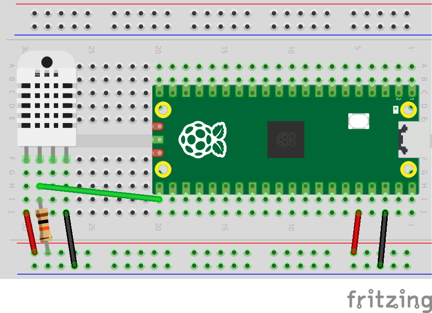

# pico2w_dht22_ssd1306

1. clone

```
git clone --recurse-submodules https://github.com/Jtl98/pico2w_dht22_ssd1306
```

2. install cmake, python and native/cross compilers

```
sudo dnf install cmake python3 @c-development arm-none-eabi-gcc-cs arm-none-eabi-gcc-cs-c++ arm-none-eabi-newlib
```

3. generate buildsystem

```
cmake -B build -S .
```

4. build

```
cmake --build build --target pico2w_dht22_ssd1306
```

5. flash

```
cp build/pico2w_dht22_ssd1306.uf2 <path/to/pico>
```

6. read

```
cat /dev/serial/by-id/<pico>
```

## datasheets

- dht22
  - [datasheets/DHT22.pdf](datasheets/DHT22.pdf)
  - https://core-electronics.com.au/attachments/DHT22.pdf

## sketches

### pico2w-dht22


